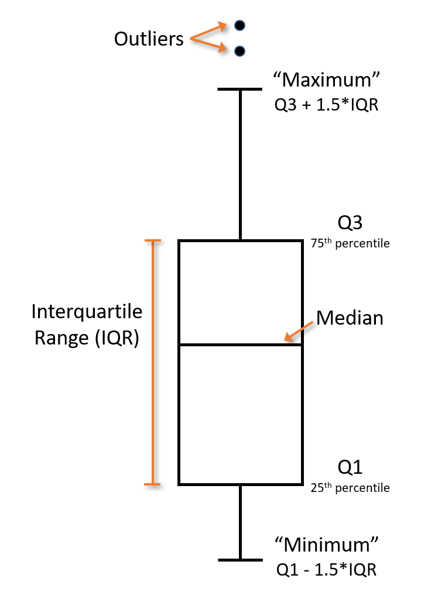

### Box plot info

The bottom and top of the box correspond with the first and third quartiles, 
respectively. The horizontal black line in each box represents the median. 
The whiskers indicate the relative min and max scores, not including outliers. 
The bottom whisker represents the 1st quartile - 1.5 \* interquartile range 
(IQR). The top whisker represents the 3rd quartile + 1.5 \* IQR. Outliers are 
indicated as solid black dots outside of the whiskers.  

#### How to read box plots  

The image shows how to read the information displayed in the box plots.  

        

   

     
