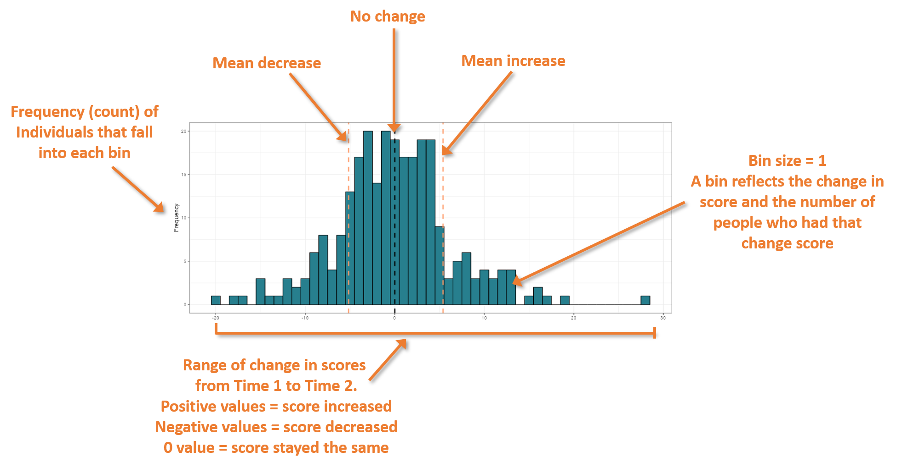

### Corset plot histogram info

These are histograms corresponding to the corset plots, showing the
distribution of change scores (i.e., the number of people who had each possible
change in their scale scores) between the 2 time points selected.    

   

#### How to read the histograms    

  

   

The histogram plots the range of the change in scores between the 2 time
points along the x-axis and the frequency of individuals that fall into
each bin on the y-axis.

-   Positive values = scores increased  
-   Negative values = scores decreased  
-   0 value = scores stayed the same (no change)

The black vertical line = no change  
The peach vertical lines = mean increase (to the right of the black
line, positive value), and mean decrease (to the left of the black line,
negative value).  

Bin size = 1. A bin reflects the change in score (reflected on the x-axis) and 
the number of people who had that change score (reflected on the y-axis).    

