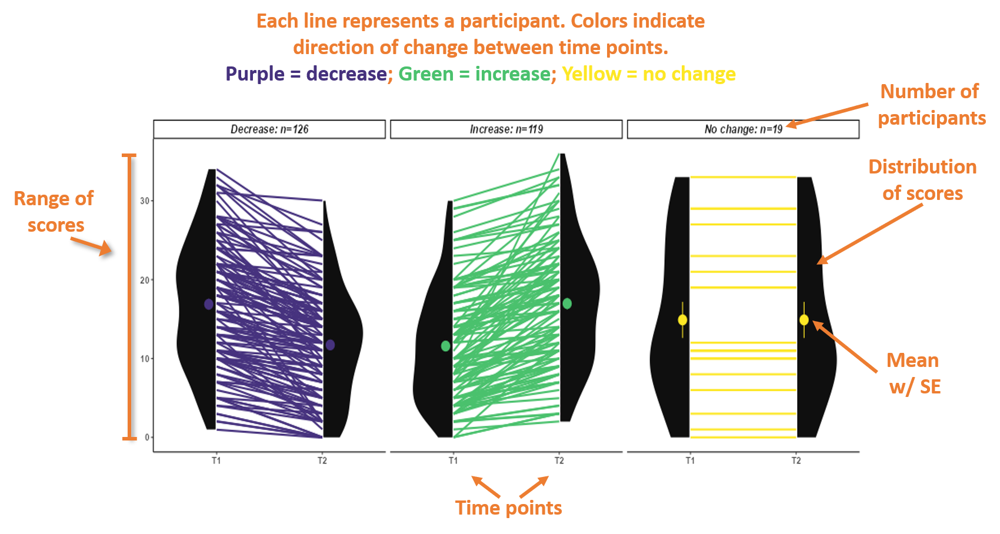

### Corset plot info

Corset plots and accompanying change score histograms depicting the change of 
each individual's score on the selected scale between the 2 time points selected.

Corset plots allow us to see the proportion of individuals whose scores increased,
decreased, or stayed the same. We can also see how similar the distribution of
scores are for participants whose score increased, decreased, or stayed the same.
We can also compare the size of the increases and decreases. For instance, those
who increased may have shown large increases, while those who decreased may have
only decreased by small amounts.   

   

#### How to read corset plots  

The image shows how to read the information displayed in the corset plots. A more
detailed description is below the image.  

        

   

     

The corset plots show change in individual scores between the 2 time points. The
two time points are on the x-axis and the scale scores are on the y-axis.  

Each line represents a participant. Plots are presented for scores that decreased, scores that increased, and scores that did not change between the 2 time points,
with colors also indicating the direction of change (Purple = Decrease, Green =
Increase, Yellow = No change).    

At the top of each plot shows which group is plotted (scores decreased, scores
increased, or no change), and the number of individuals in each of those
groupings.  

The black section on each side of the plot shows the distribution of scores
for individuals in that group (decrease, increase, no change) at that time point
(T1, T2, T3, T4). The dot in the middle of the distribution is the mean score 
for individuals in that group at that time point. The vertical lines off the 
dot indicate the SE (standard error) value. If the line is difficult to see, it
is likely due to small SE.  

