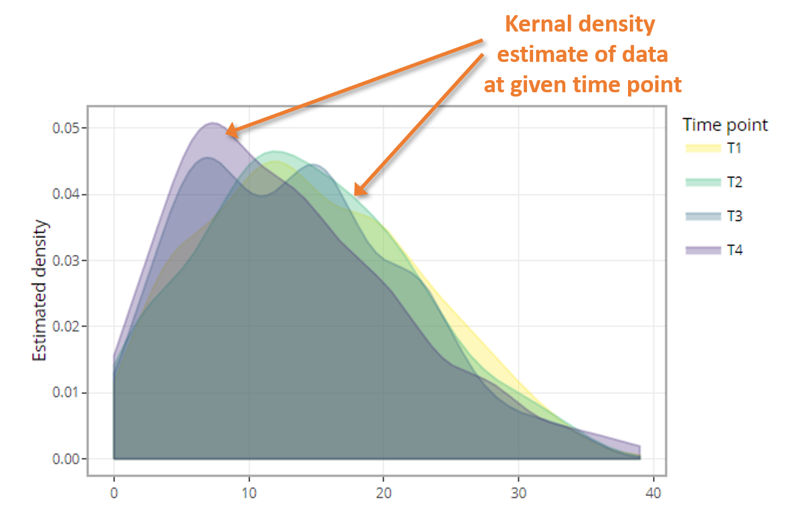

### Estimated density plot info

A density plot visualizes the distribution of data over a continuous interval 
or time period. This chart is a variation of a histogram that uses kernel 
smoothing to plot values, allowing for smoother distributions by smoothing out 
the noise.   

The peaks of a density plots help display where values are concentrated over the 
interval. An advantage density plots have over histograms is that they are 
better at determining the distribution shape because they are not affected by 
the number of bins used (each bar used in a typical histogram).   

#### How to read the estimated density plot    

 

 
