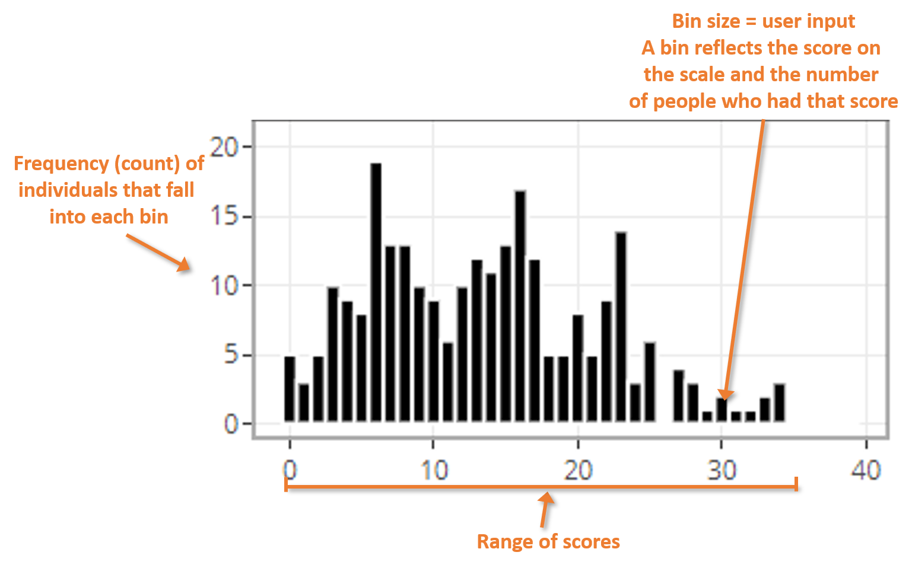

### Histogram info

Histograms plotting total scale scores along the x-axis and count/frequency of 
individuals with the corresponding total score along the y-axis. Each panel 
represents a single time point when the scale was completed by participants.   

#### How to read the histograms  

 

 

