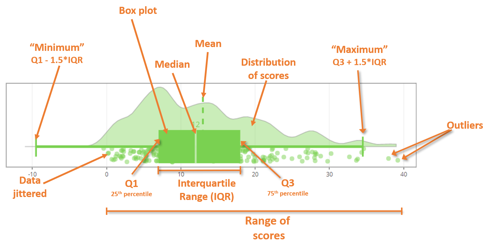

### Raincloud plot info

Raincloud plots are hybrid plots that visualize the raw data (individual
points as a scatter), distribution of data (halved violin plot), and
summary stats (box plot). The plot is constructed with the density plot
(the 'cloud') on the top, the individual data points (the rain) on the
bottom, and the box plot in between.

The plots show both the mean value (vertical dotted line) and the median
value (number printed above the box plot). The plot is interactive, so
you can hover over areas to get more information.

 

#### How to read raincloud plots

 

 
