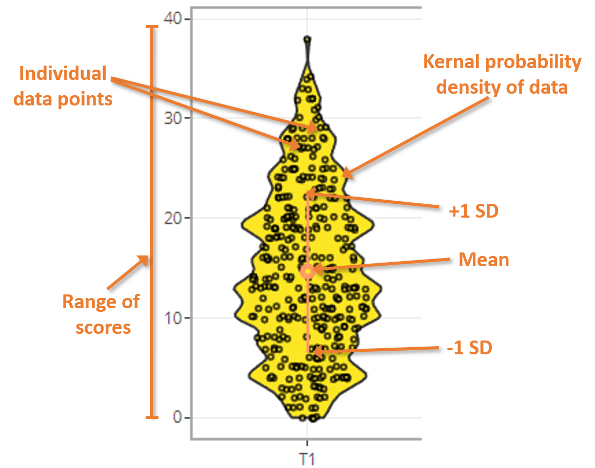

### Violin + sina plot info

Violin plots are similar to box plots, except that they show the kernal
probability density of the data at different values. The width of the
violin plots here are proportional to the number of observations. The
sina plot includes the data points, and uses the normalized density to
constrain the jitter of those points along the x-axis. This results in
the sina points following the same contour as a violin plot.  

#### How to read violin plots  

The image shows how to read the information displayed in the violin plots.  

        

   

     
